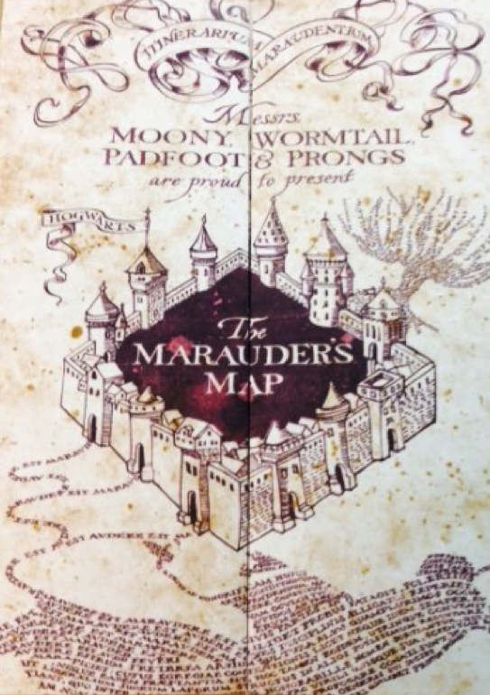

```{r setup, include=FALSE}
knitr::opts_chunk$set(echo = TRUE)
library(flexdashboard)
library(fontawesome)
## The Harry Potter Explorer Application can be Accessed Here: <http://harrypotterexplorer.com/app/>
## Supporting Documentation can be Accessed Here: <https://github.com/NPSCORELAB/harrypotterexplorer>
``` 
Background {data-icon="fa-home"}
===================================== 

Column 1
--------------------------------------------------

```{r, echo = FALSE, fig.align='center', fig.pos="h"}

```

</br>
<center>
<p>
<font size="4">
Do you solemnly swear that you are up to no good? 
</font>
</p>
</center>

</br>

<center>
<b><a href="http://harrypotterexplorer.com/app/">
<font size="6"> I do! 
</font>
</a></b>
</center>

</br>
<center>
<p>
<font size="2">
(The link above will take you to the app.)
</font>
</p>
</center>


Column 2
--------------------------------------------------

### The Application as an Educational Tool

<br>

The *Harry Potter Explorer* was developed by graduate students and faculty at the [Naval Postgraduate School](https://nps.edu/) in Monterey, CA to provide an avenue of exposure to statistical analysis techniques for middle and high school students that attempt to explain a given social network. Using J.K. Rowling's Harry Potter series (Rowling, "Harry Potter"), the application provides a familiar story while introducing unfamiliar methods.

Additionally, this application provides a means to interact with a large amount of data. Should the same information be provided via spreadsheets, pins on a map, and various other documents the ability to discern what the data is telling you is severely degraded. To that point, the application shows that "big data" can be transformed into meaningful visualizations. 

### Learning Objectives

<br>

The application's intended learning objectives include developing a reasoned course of action to disrupt the Death Eater's network. By interpreting and exploring the strengths and weaknesses presented by both the Dumbledore's Army and the Death Eater's, students can identify and defend any multitude of potential actions to disrupt the Death Eaters. While there are not any necessarily wrong options, good options use the analytical tools provided in the application to support their choice.  

### Resources

<br>

Read more about Harry Potter networks at:

<center>
<b>
<a href= "https://papers.ssrn.com/sol3/papers.cfm?abstract_id=3389503">
`r fa('file', height = "20px")`
Strong Ties and Where to Find Them: Or, Why Neville (and Ginny and Seamus) and Bellatrix (and Lucius) Might Be More Important than Harry and Tom
</a>
</b>
</center>

</br>

If you are interested in finding out more about how this application was made, check out the Github repo:

<center>
<a href= "https://github.com/NPSCORELAB/harrypotterexplorer">
`r fa('github', height = "20px")`
NPSCORELAB/harrypotterexplorer
</a>
</center>

Using the App {data-icon="fa-book"}
=====================================

Column 1
--------------------------------------------------

### The Scenario

SNA has been used, for example, to enhance corporate effectiveness as well as to develop counter-terrorism and counter-drug cartel operations. By understanding how an organization or a group of organizations operate and interact, policy can be developed to either increase productivity or disrupt "dark" networks. This application provides a scenario where students can both determine ways to support Dumbledore's Army as well as disrupt the Death Eaters. 

The application's objective is to identify where each of the organizations is strongest and weakest and use the information to develop options to disrupt the Death Eaters network. As such, any sort of backstory can be easily developed to commence the analytical process. The scenario developed at the Naval Postgraduate School simply divided students into groups of four or five and labeled each as one of Professor Dumbledore's intelligence cells. Having multiple groups provides for competing courses of action, which ensures each group considers the viability of the option they develop. The students are prompted with the following questions: 
  
  - Who are you going to stop?
  - Who are you going to send?
  - Where are you going to send them?
  - What spells match up?
  
  
Column 2
--------------------------------------------------

### The Dumbledore's Army and Death Eater's Network Tabs

This tab provides the sociogram with the associated statistic measurement options.

Because the strength of the relationships are weighted, where a "1" equals a weak relationship and a "5" equals a strong relationship, a "Strength of tie cutoff" slide is provided. This can show where the network is strongest based on how strong the relationships are. 

The "Size nodes by measure" provides a list of SNA centrality measurements with the associated interpretation. The nodes will adjust size dependent on the measurement chosen, where the larger node means they rank higher in that centrality measure.

The network member's attributes can be viewed by clicking on the "Table" link


Column 3
--------------------------------------------------

### The Geospatial Tab
  
  This tab displays Dumbledore's Army and the Death Eaters' members location.

